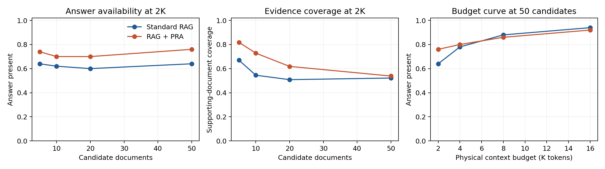
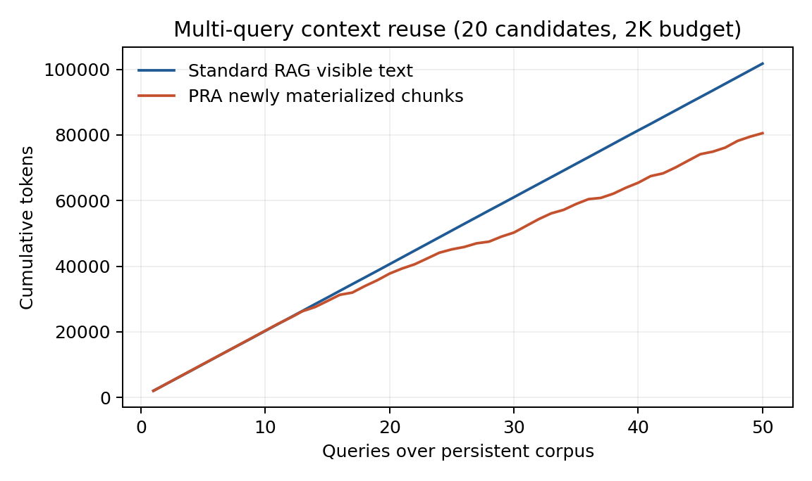
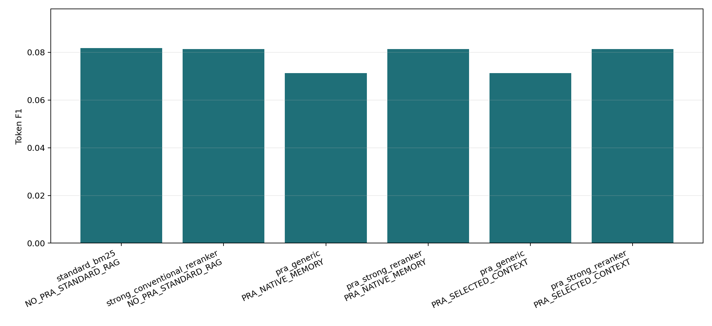
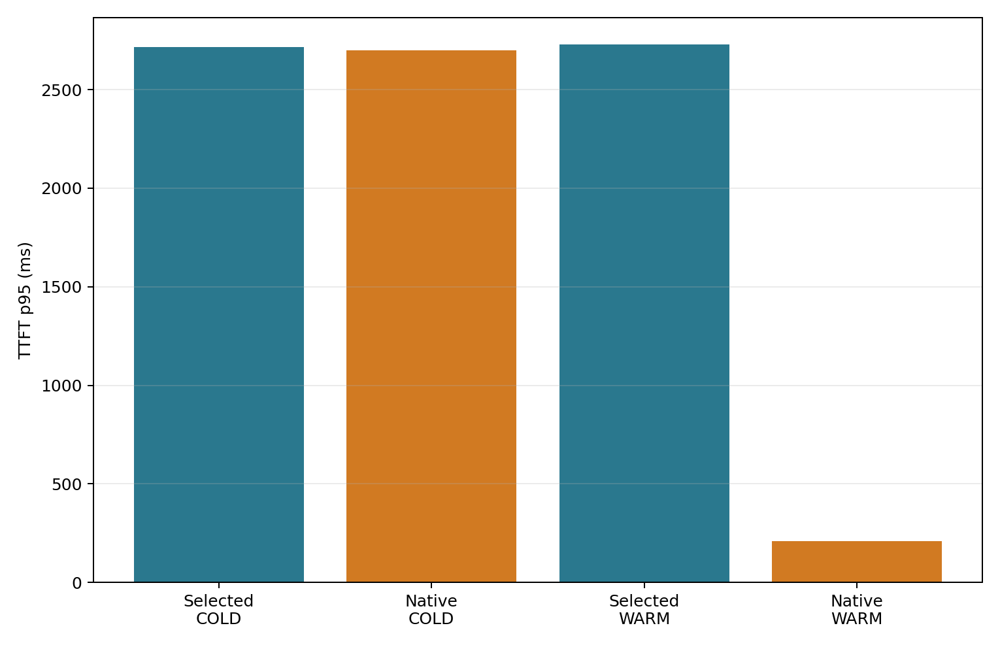
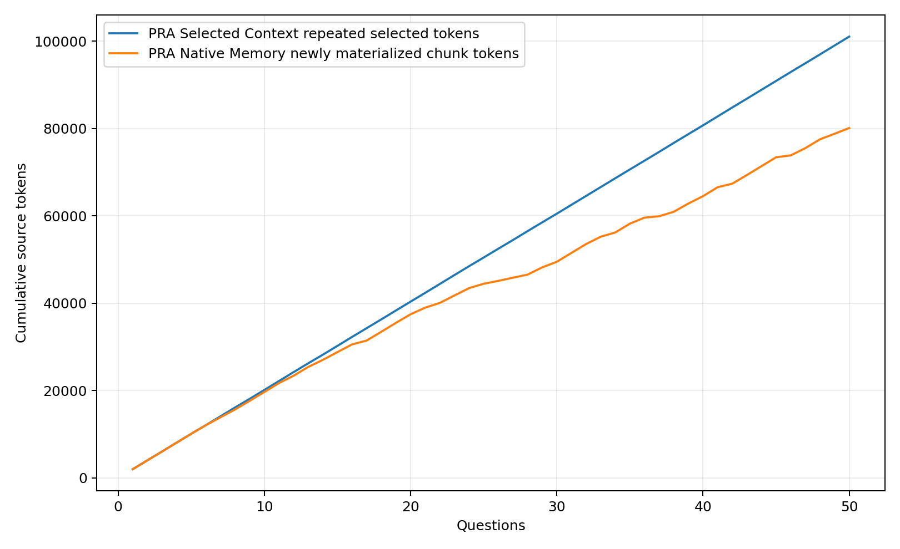
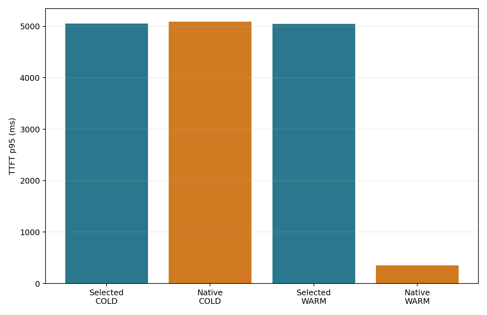

# Results

## MultiHop-RAG selection probe

The table reports the 2K physical-budget result over 50 held-out questions. `Answer present` means an accepted answer string occurs in selected context; it is not generated-answer EM.

| Stage | Candidates | Condition | Answer present | Support docs | Support spans | False selected docs |
| --- | ---: | --- | ---: | ---: | ---: | ---: |
| Gold-present L1 | 5 | Standard RAG | 0.64 | 0.670 | 0.368 | 0.518 |
| Gold-present L1 | 5 | RAG + PRA | **0.74** | **0.818** | **0.525** | **0.468** |
| Gold-present L1 | 20 | Standard RAG | 0.60 | 0.508 | 0.315 | 0.736 |
| Gold-present L1 | 20 | RAG + PRA | **0.70** | **0.618** | **0.385** | **0.721** |
| Gold-present L1 | 50 | Standard RAG | 0.64 | 0.522 | **0.345** | **0.774** |
| Gold-present L1 | 50 | RAG + PRA | **0.76** | **0.538** | 0.310 | 0.785 |
| Real BM25 L2 | 5 | Standard RAG | 0.58 | 0.405 | 0.247 | **0.684** |
| Real BM25 L2 | 5 | RAG + PRA | **0.68** | **0.472** | **0.327** | 0.701 |
| Real BM25 L2 | 20 | Standard RAG | 0.56 | 0.430 | 0.268 | **0.769** |
| Real BM25 L2 | 20 | RAG + PRA | **0.68** | **0.493** | **0.318** | 0.777 |
| Real BM25 L2 | 50 | Standard RAG | 0.64 | **0.515** | **0.338** | **0.776** |
| Real BM25 L2 | 50 | RAG + PRA | **0.76** | 0.505 | 0.300 | 0.795 |

At 2K, generic PRA improves answer availability by 0.10--0.12 absolute across these displayed settings. The cleanest mechanism result is at 5--20 candidates, where supporting-document and span coverage also improve. At 50 real-retrieval candidates, answer availability rises while gold coverage falls slightly and false selection increases. That row is a warning against interpreting answer-string presence as grounded answer quality.

At 8K--16K, the selectors converge because most useful chunks fit. The measured opportunity is therefore budget pressure, not an unconditional quality advantage.

## Logical reuse diagnostic

The accounting cohort avoids 20.8% of repeated chunk materialization after 50 queries. A physical MLX follow-up is reported below.

## Qwen3-4B MLX generation smoke

Ten of the same L1 questions were executed with the exact `mlx-community/Qwen3-4B-4bit` revision on a 48 GiB M4 Pro. Standard RAG used selected text in the ordinary prompt cache. PRA used the generic selector and all-layer detached native K/V. Both used greedy 32-token generation after symmetric path warm-up.

| Candidates | Condition | Official task score | Strict EM | Token F1 | TTFT ms | Completion ms | Visible prompt tokens | Native K/V tokens |
| ---: | --- | ---: | ---: | ---: | ---: | ---: | ---: | ---: |
| 20 | Standard RAG | **0.90** | 0.00 | **0.094** | 172.2 | **563.4** | 2,110 | 0 |
| 20 | RAG + PRA | 0.70 | 0.00 | 0.077 | 172.8 | 646.6 | **82** | 2,032 |
| 50 | Standard RAG | **0.90** | 0.00 | **0.091** | **165.4** | **557.1** | 2,107 | 0 |
| 50 | RAG + PRA | 0.80 | 0.00 | 0.081 | 174.5 | 646.9 | **82** | 2,035 |

The model often generated explanatory sentences, so strict short-answer EM is zero even when the gold answer token appears. The official task score is therefore more informative here, but the strict values remain visible. PRA reduces visible prompt tokens by about 96%, yet its all-layer 2K-token native memory occupies about 300 MB. Cold source ingestion is similar (`2.39--2.46` seconds), while native completion is about 15% slower. This smoke closes neither the quality nor economic gate.

The product comparison changes both context selection and representation, by design. It does not by itself attribute the quality loss to routing versus native transport. Prior frozen-selection MLX parity checks cover transport; a larger RAG cohort should repeat that control within this exact benchmark.

## Powered 50-question decomposition

The powered follow-up uses the same 50 held-out questions at `N=20` and a 2K physical-token budget. It separates selection from realization: each PRA selector writes one signed selection receipt, then Selected Context and Native Memory consume that exact receipt. The model is the pinned `mlx-community/Qwen3-4B-4bit` revision; no exact MultiHop-RAG adaptor is qualified, so bundle arms are explicitly `NO_QUALIFIED_ADAPTER`.

| Selector and condition | Official score | Token F1 | Answer present | Support docs | False selected docs |
| --- | ---: | ---: | ---: | ---: | ---: |
| Standard BM25, No PRA | **0.500** | **0.082** | 0.56 | 0.400 | 0.752 |
| Strong reranker, No PRA | 0.440 | 0.081 | **0.70** | 0.455 | **0.691** |
| Generic PRA, Selected Context | 0.440 | 0.071 | 0.64 | **0.468** | 0.751 |
| Generic PRA, Native Memory | 0.440 | 0.071 | 0.64 | **0.468** | 0.751 |
| Strong reranker PRA, Selected Context | 0.440 | 0.081 | **0.70** | 0.455 | **0.691** |
| Strong reranker PRA, Native Memory | 0.440 | 0.081 | **0.70** | 0.455 | **0.691** |

The selection gate remains closed. Generic PRA exposes slightly more supporting-document evidence than BM25 but reduces generated score; the strong reranker exposes the answer more often without improving generated score. This is precisely why evidence availability and model output are reported separately.

The native realization gate passes. Selected Context and Native Memory produce identical outputs for every frozen generic and strong-reranker selection. The strong conventional arm and strong PRA Selected Context arm are also exact receipt/output controls, ruling out a label-specific execution advantage.

| Generic PRA realization | Mean TTFT | TTFT p95 | Total latency | Visible tokens | Native tokens | Native reuse |
| --- | ---: | ---: | ---: | ---: | ---: | ---: |
| Selected Context, cold | 2,633 ms | 2,716 ms | 3,024 ms | 2,105 | 0 | 0.00 |
| Native Memory, cold | 2,648 ms | 2,701 ms | 3,121 ms | **79** | 2,026 | 0.00 |
| Selected Context, warm | 2,640 ms | 2,728 ms | 3,031 ms | 2,105 | 0 | 0.00 |
| Native Memory, warm | **166 ms** | **211 ms** | **638 ms** | **79** | 2,026 | **1.00** |

Cold Native Memory is 96 ms slower end to end than Selected Context. With retained immutable K/V, however, it avoids repeated source prefill: TTFT falls by 2.47 seconds and total latency by 2.39 seconds while generated quality remains exact. Active detail is about 299 MB. The economic gate therefore passes for repeated identical selections, not for every RAG workload.

## Distractor and budget boundary

The secondary powered cell increases the candidate set to `N=50` and the selected-token budget to 4K. All four selectors obtain `0.460` official score. Token F1 is `0.075` for standard BM25, `0.081` for the strong conventional reranker, `0.080` for generic PRA, and `0.081` for strong-reranker PRA. Generic PRA has the highest answer availability (`0.76`), but does not beat the strong control on generated quality; bootstrap intervals overlap.

Selector-frozen Selected Context and Native Memory remain output-exact at 4K. Cold Native Memory costs `6.313 s` versus `6.109 s` for Selected Context. Reusing the retained 4K selection costs `0.799 s` versus `6.121 s` for selected-text re-prefill, an `86.9%` reduction. It moves about `4,084` tokens out of the visible prompt at an active-detail cost of about `602 MB`. This is not a comparison with an ordinary prefix-cache hit.

## Physical persistent chunks

The physical persistent-corpus run caches independently encoded 256-token chunks across 50 changing questions. It records a `22.0%` mean native chunk-hit fraction, materializes `80,117` unique native tokens rather than roughly `101,294` selected tokens, and reduces cumulative request wall time from `151.19 s` to `131.78 s` (`12.8%`). Mean TTFT falls from `2.633 s` to `2.163 s`, while retained detail grows to `6.38 GB`.

The output is not exact: official score changes from `0.440` for Selected Context to `0.380` for Native Memory, while token F1 changes from `0.071` to `0.086`. The cause is representational, not a hidden selector change: independently encoded chunks retain source-local post-RoPE positions, while selected-text concatenation creates one global position sequence. The decomposition gates are therefore `NOT_APPLICABLE_PERSISTENT_CORPUS`; position-aware chunk composition must qualify separately.

## Qwen3-8B replication

The prespecified larger-generator replication uses the same 50 question IDs, `N=20`, 2K budget, candidate receipts, and selectors with pinned `mlx-community/Qwen3-8B-4bit`. Standard BM25 obtains `0.520` official score and `0.093` F1; the strong conventional reranker obtains `0.480` and `0.096`; generic PRA obtains `0.440` and `0.081`. The larger generator modestly improves F1 but does not change the selector ordering. The selection gate remains closed.

Every generic and strong-reranker Selected Context/Native Memory pair remains output-exact. Generic cold Native Memory costs `5.636 s` versus `5.535 s` for Selected Context (`+1.8%`). Retaining the same native selection costs `0.990 s` versus `5.541 s` for selected-text re-prefill (`-82.1%`), and lowers mean TTFT from `4.908 s` to `0.276 s`. Active detail is about `285 MB`. Native realization and repeated-selection economics therefore transfer from 4B to 8B within Qwen, but no selector or adaptor is qualified.

## Claim boundary

The 50-question curves establish auditable candidate controls and a parameter-free selection signal. The original 10-question smoke remains a negative end-to-end gate. The powered cohorts localize that failure to selection and establish selector-frozen contiguous-native parity plus a warm repeated-selection runtime win at 2K and 4K. They do **not** qualify generic PRA selection or a learned adaptor. Physical changing-selection reuse is promising but position-sensitive, so it is evidence for the next representation design rather than a broad persistent-corpus claim. Qwen3-8B repeats both the failed generic-selection gate and the successful contiguous-native realization gate.
